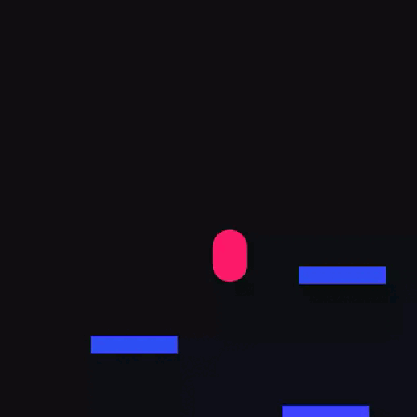

# Fraxel

> A modern node-based 2D game engine for the web powered by JSX and fine-grained reactivity.

[](https://github.com/sanchedev/fraxel/actions)
[](https://www.npmjs.com/package/fraxel)
[](LICENSE)
[](https://www.typescriptlang.org/)

**Fraxel** lets you build browser games with JSX without React, DOM rendering, or virtual DOM reconciliation. JSX creates a game scene graph, signals update node properties directly, and the runtime renders everything to canvas.

<p align="center">
  
</p>

## Packages

| Package                                       | Description                                | Version                                                                                                       |
| --------------------------------------------- | ------------------------------------------ | ------------------------------------------------------------------------------------------------------------- |
| [`fraxel`](packages/fraxel)                   | Core JSX runtime, engine, nodes, and hooks | [](https://www.npmjs.com/package/fraxel)                           |
| [`create-fraxel`](packages/create-fraxel)     | Project scaffolder with starter templates  | [](https://www.npmjs.com/package/create-fraxel)             |
| [`@fraxel/vite-plugin`](packages/vite-plugin) | Vite integration and asset imports         | [](https://www.npmjs.com/package/@fraxel/vite-plugin) |

## Features

- JSX scene graph with native nodes such as `<sprite>`, `<body>`, `<collider>`, `<camera>`, `<text>`, `<draggable>`, and `<droparea>`.
- Fine-grained reactivity through signals and computed JSX props.
- Pointer interactions with `Pointer` events, clickable areas, draggable nodes, and drop areas.
- Input actions with `Input.createAction()`, `useAction()`, and `useActionAxis()`.
- Collision, raycast, rigid body, detector, and physics primitives.
- Camera, audio, text, tilemap, sprite animation, tweening, and visual filters.
- Vite asset pipeline for `?texture` and `?sound` imports through `@fraxel/vite-plugin`.
- TypeScript-first APIs and a custom JSX runtime.

## Create A Project

The fastest way to start is the official scaffolder:

```bash
pnpm create fraxel
```

Available templates:

| Template     | Description                        |
| ------------ | ---------------------------------- |
| `empty`      | Minimal scene and project setup    |
| `platformer` | Basic platformer with physics      |
| `top-down`   | Top-down movement with collisions  |
| `coin-box`   | Drag-and-drop coin collection game |

You can also install the engine manually:

```bash
pnpm add fraxel
pnpm add -D @fraxel/vite-plugin
```

Configure the JSX runtime in `tsconfig.json`:

```json
{
  "compilerOptions": {
    "jsx": "react-jsx",
    "jsxImportSource": "fraxel"
  }
}
```

For Vite projects, add the plugin:

```ts
import { defineConfig } from 'vite'
import { fraxel } from '@fraxel/vite-plugin'

export default defineConfig({
  plugins: [fraxel()],
})
```

## Example

```tsx
import {
  createGame,
  GameRoot,
  SceneRoot,
  Input,
  loadTexture,
  shapes,
  useActionAxis,
  useEffect,
  useRigidBody,
} from 'fraxel'

const PLAYER = await loadTexture('/player.png')

const Left = Input.createAction({ key: 'a' })
const Right = Input.createAction({ key: 'd' })

function Player() {
  const body = useRigidBody()
  const axis = useActionAxis(Left, Right)

  useEffect(() => {
    body.setVelocity([axis() * 120, body.velocity().y])
  })

  return (
    <body ref={body} position={[80, 80]} mass={1}>
      <sprite textureId={PLAYER} />
      <collider shape={shapes.rectangle(16, 16)} />
    </body>
  )
}

function MainScene() {
  return <Player />
}

const game = createGame(
  <GameRoot width={320} height={240} defaultScene="main">
    <SceneRoot name="main" component={MainScene} />
  </GameRoot>,
  document.querySelector('#root')!,
)

game.play()
```

## Development

This repository is a pnpm workspace. Use package filters for package-specific builds.

```bash
pnpm lint
pnpm format:check
pnpm --filter fraxel build
pnpm --filter create-fraxel build
pnpm --filter @fraxel/vite-plugin build
```

Workspace packages live under `packages/*`. Playground apps can live under `playground/*`.

## Documentation

The current in-repository references are package-level docs and API notes:

- [Engine README](packages/fraxel/README.md)
- [Engine changelog](packages/fraxel/CHANGELOG.md)
- [Scaffolder README](packages/create-fraxel/README.md)
- [Vite plugin README](packages/vite-plugin/README.md)

## License

MIT
